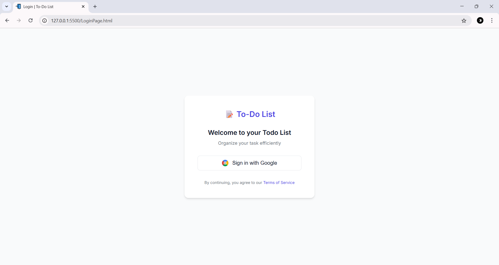
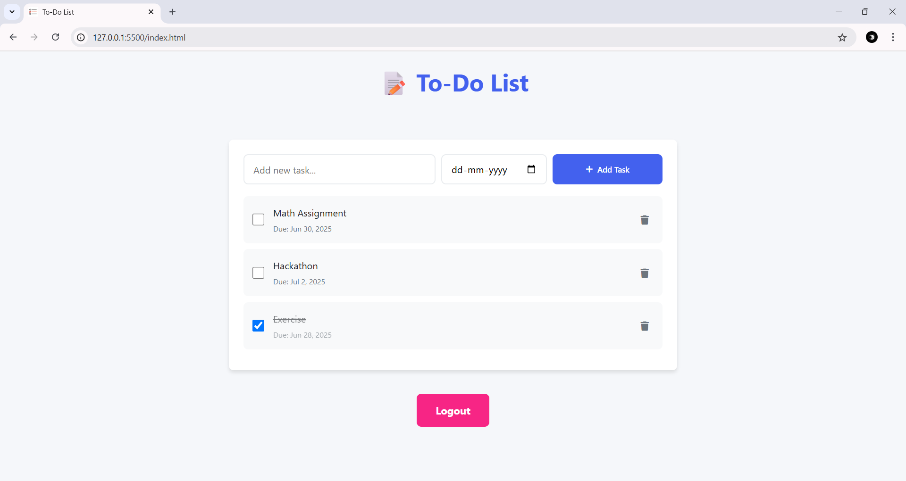
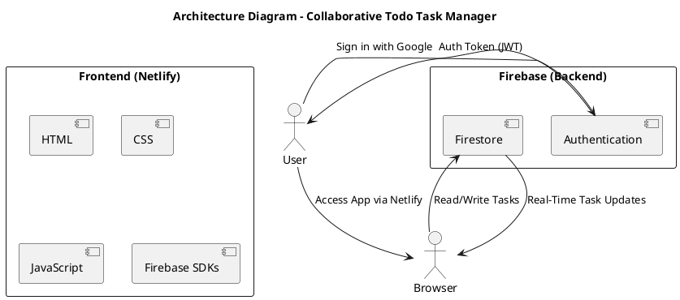

# 📝 Collaborative Todo Task Manager (Web)

A responsive and user-friendly task management web application built using **HTML**, **CSS**, **JavaScript**, and **Firebase**. Users can securely sign in using Google, create and manage tasks with due dates, and view real-time updates—all from a clean, intuitive UI.

🔗 **Live Demo**: [https://todo-49.netlify.app/](https://todo-49.netlify.app/)

---

## ✨ Features

- 🔐 **Google Sign-In via Firebase Authentication**  
  Secure login using Google OAuth 2.0.

- 📝 **Add, Edit, and Delete Tasks**  
  Create and manage tasks with full CRUD functionality.

- 🕓 **Due Dates with Defaults**  
  Tasks default to today’s date if none is selected.

- 📂 **Filter Tasks**  
  View all tasks, completed tasks, or incomplete tasks.

- 📶 **Real-Time Updates**  
  Firebase Firestore syncs tasks instantly across sessions.

- 💾 **Offline Support**  
  Uses local storage to preserve tasks temporarily offline.

- 📱 **Mobile-Friendly Design**  
  Fully responsive layout with media queries for all devices.

---

## 📷 Screenshots

| Login Page | Home Page | Task View |
|------------|-----------|-----------|
|  |  |  |

---

## 📽 Demo Video

🎥 [Watch Demo on Google Drive](https://drive.google.com/file/d/1j4k6nkLrJ4sGIe3l3EUD6Eg_f9hlPY0A/view?usp=drive_link)

---

## 🗂 Architecture Diagram

---

> 🏁 **This project is a part of a hackathon run by [https://www.katomaran.com](https://www.katomaran.com)**
