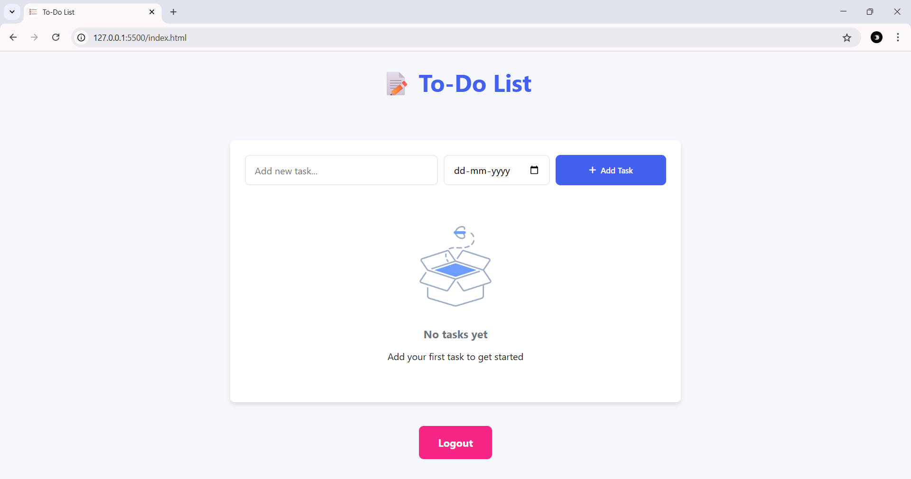
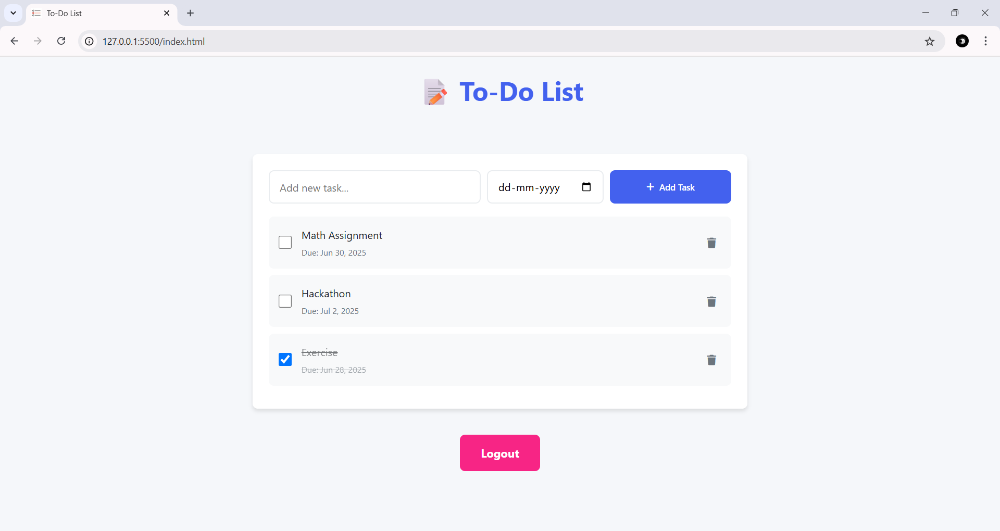

[](url)# 📝 To-Do List Web App

A clean and responsive To-Do List web application built using **HTML**, **CSS**, **JavaScript**, and **Firebase Authentication**. Users can securely log in with their Google account, add tasks with due dates, mark them as complete, and delete them. The app sorts tasks by due date and places completed tasks at the bottom.

---

## ✅ Features

- 🔐 Google Login using Firebase Authentication
- ➕ Add tasks with due dates
- ✅ Mark tasks as complete/incomplete
- ⬇️ Completed tasks move to the bottom
- 📅 Tasks sorted by due date
- 🗑️ Delete tasks
- 🔓 Logout button included
- 💾 Data stored locally using `localStorage`
- 📱 Fully responsive design

---

## 🧠 Assumptions Made

- A **Logout button** is added for users to securely sign out.
- Tasks are **sorted by due date** to prioritize upcoming tasks.
- **Completed tasks move to the bottom** of the list automatically.

  ---
  

## 🏗️ Architecture Diagram


🏗️ Architecture Diagram

```plaintext
User Browser
     │
     ▼
Login via Google
     │
     ▼
Firebase Authentication (Client SDK)
     │
     ▼
index.html (HomePage)
     │
     ├── Add / Delete / Mark Complete
     └── Stored in localStorage
     ▼
DOM updates via JavaScript


---


## 📱 Screenshots

| Login Page | Homepage | Task Form |
|------------|----------|-----------|
|  |  |  |

---

🎥 [Watch Demo Video](https://drive.google.com/file/d/1j4k6nkLrJ4sGIe3l3EUD6Eg_f9hlPY0A/view?usp=drive_link)

This video demonstrates the To-Do List Web App built using HTML, CSS, JavaScript, and Firebase Authentication.
It highlights key features such as Google Login, due date sorting, completed task handling, and logout functionality.

---

This project is a part of a hackathon run by https://www.katomaran.com 

